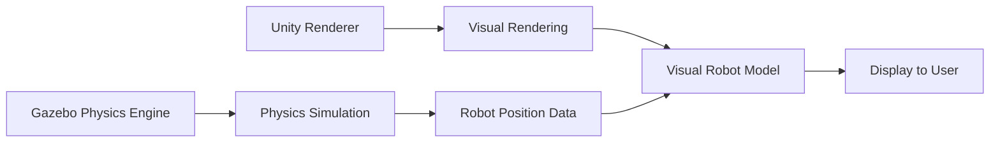
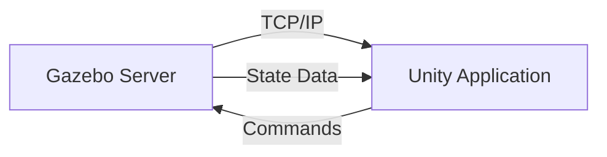
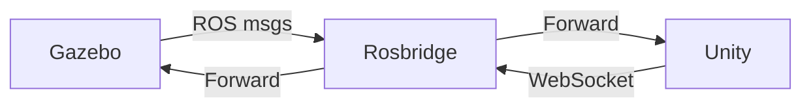
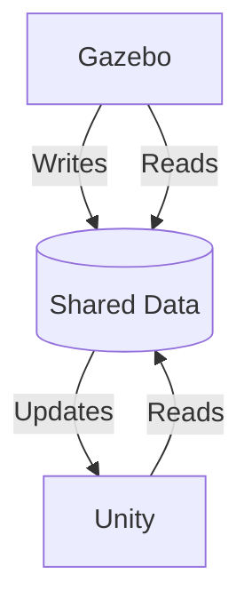

# Unity's Role Alongside Gazebo

This article explores how Unity complements Gazebo in the simulation workflow for digital twin applications, highlighting the synergistic relationship between physics-based simulation and high-fidelity visual rendering.

## Learning Objectives

By the end of this article, you will be able to:
- Understand the complementary roles of Unity and Gazebo in digital twin workflows
- Identify scenarios where Unity enhances Gazebo-based simulations
- Design integration strategies for combined Unity-Gazebo workflows
- Evaluate when to use each platform individually versus in combination

## Introduction to Complementary Simulation Platforms

Unity and Gazebo serve different but complementary roles in robotics simulation. While Gazebo excels at physics-based simulation with accurate dynamics and collision detection, Unity provides high-fidelity visual rendering and immersive interaction capabilities. Understanding how to leverage both platforms creates comprehensive digital twin environments.

### Strengths of Each Platform

| Aspect | Gazebo | Unity |
|--------|--------|-------|
| **Physics Simulation** | Industry-standard accuracy | Basic to moderate |
| **Collision Detection** | Highly accurate | Moderate accuracy |
| **Sensor Simulation** | Realistic sensors (LiDAR, cameras, IMUs) | Basic visual sensors |
| **Visual Quality** | Functional, basic rendering | High-fidelity, photorealistic |
| **Graphics Performance** | Optimized for simulation | Optimized for visual quality |
| **User Interaction** | Limited GUI | Rich interaction models |
| **Development Speed** | Fast for robotics | Fast for visual content |
| **Learning Curve** | Robotics-focused | Game development-focused |

## Complementary Use Cases

### 1. Visual Enhancement of Physics Simulation

Gazebo handles the physics while Unity provides the visual layer:



#### Implementation Example:
```csharp
// Unity script to receive robot position from Gazebo simulation
using UnityEngine;
using System.Collections;
using System.Net.Sockets;
using System.Text;

public class GazeboRobotSync : MonoBehaviour
{
    private TcpClient tcpClient;
    private NetworkStream stream;
    private string gazeboHost = "localhost";
    private int gazeboPort = 11345;

    void Start()
    {
        StartCoroutine(ConnectToGazebo());
    }

    IEnumerator ConnectToGazebo()
    {
        yield return new WaitForSeconds(1.0f); // Allow Gazebo to start

        try
        {
            tcpClient = new TcpClient(gazeboHost, gazeboPort);
            stream = tcpClient.GetStream();

            StartCoroutine(ReceiveRobotData());
        }
        catch (System.Exception e)
        {
            Debug.LogError("Could not connect to Gazebo: " + e.Message);
        }
    }

    IEnumerator ReceiveRobotData()
    {
        byte[] buffer = new byte[1024];

        while (tcpClient.Connected)
        {
            try
            {
                int bytesRead = stream.Read(buffer, 0, buffer.Length);

                if (bytesRead > 0)
                {
                    string data = Encoding.UTF8.GetString(buffer, 0, bytesRead);
                    RobotPose pose = ParseRobotPose(data);

                    // Update Unity robot model position
                    UpdateRobotPosition(pose);
                }
            }
            catch (System.Exception e)
            {
                Debug.LogError("Error receiving data: " + e.Message);
                break;
            }

            yield return new WaitForSeconds(0.016f); // ~60 FPS update
        }
    }

    RobotPose ParseRobotPose(string data)
    {
        // Parse position and orientation data from Gazebo
        // This would depend on the specific message format used
        string[] parts = data.Split(',');

        if (parts.Length >= 7) // x, y, z, qx, qy, qz, qw
        {
            return new RobotPose
            {
                position = new Vector3(
                    float.Parse(parts[0]),
                    float.Parse(parts[1]),
                    float.Parse(parts[2])
                ),
                rotation = new Quaternion(
                    float.Parse(parts[3]),
                    float.Parse(parts[4]),
                    float.Parse(parts[5]),
                    float.Parse(parts[6])
                )
            };
        }

        return new RobotPose(); // Default pose if parsing fails
    }

    void UpdateRobotPosition(RobotPose pose)
    {
        transform.position = pose.position;
        transform.rotation = pose.rotation;
    }
}

[System.Serializable]
public struct RobotPose
{
    public Vector3 position;
    public Quaternion rotation;
}
```

### 2. Human-in-the-Loop Simulation

Unity provides the user interface while Gazebo handles the physics:

```csharp
// Unity script for user input that gets sent to Gazebo
using UnityEngine;
using System.Collections.Generic;

public class HumanInputToGazebo : MonoBehaviour
{
    public string gazeboServer = "localhost";
    public int gazeboPort = 11346;

    private Queue<string> commandQueue = new Queue<string>();

    void Update()
    {
        // Capture user input
        if (Input.GetKeyDown(KeyCode.W))
        {
            SendCommand("robot/move_forward");
        }
        else if (Input.GetKeyDown(KeyCode.S))
        {
            SendCommand("robot/move_backward");
        }
        else if (Input.GetKeyDown(KeyCode.A))
        {
            SendCommand("robot/turn_left");
        }
        else if (Input.GetKeyDown(KeyCode.D))
        {
            SendCommand("robot/turn_right");
        }

        // Process command queue
        ProcessCommandQueue();
    }

    void SendCommand(string command)
    {
        commandQueue.Enqueue(command);
    }

    void ProcessCommandQueue()
    {
        // Send commands to Gazebo (implementation would use TCP/UDP)
        while (commandQueue.Count > 0)
        {
            string command = commandQueue.Dequeue();
            SendToGazebo(command);
        }
    }

    void SendToGazebo(string command)
    {
        // Implementation to send command to Gazebo server
        Debug.Log("Sending command to Gazebo: " + command);
    }
}
```

## Integration Architectures

### 1. Direct Communication Architecture

The simplest integration where Unity and Gazebo communicate directly:



#### Advantages:
- Simple to implement
- Low latency
- Direct control flow

#### Disadvantages:
- Tight coupling
- Single point of failure
- Limited scalability

### 2. Message Broker Architecture

Using a message broker like ROS/Rosbridge for communication:



```javascript
// Unity WebSocket client for Rosbridge
using UnityEngine;
using System.Collections;
using Newtonsoft.Json.Linq;

public class RosbridgeUnityClient : MonoBehaviour
{
    private WebSocket websocket;
    private string rosbridgeUrl = "ws://localhost:9090";

    void Start()
    {
        StartCoroutine(ConnectToRosbridge());
    }

    IEnumerator ConnectToRosbridge()
    {
        websocket = new WebSocket(new System.Uri(rosbridgeUrl));
        yield return StartCoroutine(websocket.Connect());

        // Subscribe to robot state
        SubscribeToRobotState();

        // Start sending/receiving messages
        StartCoroutine(ProcessMessages());
    }

    void SubscribeToRobotState()
    {
        var subscribeMsg = new JObject
        {
            ["op"] = "subscribe",
            ["topic"] = "/robot_state",
            ["type"] = "std_msgs/String"
        };

        websocket.Send(subscribeMsg.ToString());
    }

    IEnumerator ProcessMessages()
    {
        while (websocket.State == WebSocketState.Open)
        {
            if (websocket.IsTextMessageAvailable)
            {
                string message = websocket.RecvText();
                ProcessRosMessage(message);
            }

            yield return null;
        }
    }

    void ProcessRosMessage(string message)
    {
        JObject msgObj = JObject.Parse(message);

        if (msgObj["topic"]?.ToString() == "/robot_state")
        {
            // Update Unity visualization based on robot state
            UpdateVisualization(msgObj["msg"]);
        }
    }

    void UpdateVisualization(JToken robotState)
    {
        // Update Unity objects based on robot state data
        float x = robotState["pose"]["position"]["x"].Value<float>();
        float y = robotState["pose"]["position"]["y"].Value<float>();
        float z = robotState["pose"]["position"]["z"].Value<float>();

        transform.position = new Vector3(x, y, z);
    }
}
```

### 3. Shared Data Architecture

Both platforms access shared data stores:



## Practical Integration Examples

### 1. Sensor Data Visualization

Visualizing Gazebo sensor data in Unity:

```csharp
using UnityEngine;
using System.Collections.Generic;

public class SensorDataVisualizer : MonoBehaviour
{
    public GameObject lidarPointCloud;
    public Material lidarPointMaterial;
    public GameObject cameraFeedPlane;

    private List<Vector3> lidarPoints = new List<Vector3>();
    private Texture2D cameraTexture;

    void Update()
    {
        // Update LiDAR point cloud visualization
        UpdateLidarVisualization();

        // Update camera feed visualization
        UpdateCameraVisualization();
    }

    void UpdateLidarVisualization()
    {
        // Clear previous points
        foreach (Transform child in lidarPointCloud.transform)
        {
            Destroy(child.gameObject);
        }

        // Create new points based on sensor data
        foreach (Vector3 point in lidarPoints)
        {
            GameObject pointObj = GameObject.CreatePrimitive(PrimitiveType.Sphere);
            pointObj.transform.SetParent(lidarPointCloud.transform);
            pointObj.transform.position = point;
            pointObj.transform.localScale = Vector3.one * 0.01f;
            pointObj.GetComponent<Renderer>().material = lidarPointMaterial;
        }
    }

    void UpdateCameraVisualization()
    {
        // Update camera texture if available
        if (cameraTexture != null)
        {
            cameraFeedPlane.GetComponent<Renderer>().material.mainTexture = cameraTexture;
        }
    }

    // Called when new sensor data arrives from Gazebo
    public void UpdateLidarData(List<Vector3> newPoints)
    {
        lidarPoints = newPoints;
    }

    public void UpdateCameraData(Texture2D newTexture)
    {
        cameraTexture = newTexture;
    }
}
```

### 2. Control Interface

Creating a unified control interface:

```csharp
using UnityEngine;
using UnityEngine.UI;
using System.Collections;

public class UnifiedControlInterface : MonoBehaviour
{
    public Slider speedSlider;
    public Toggle autonomousModeToggle;
    public Button emergencyStopButton;
    public Text statusText;

    private bool autonomousMode = false;
    private bool emergencyStopActive = false;

    void Start()
    {
        // Setup UI event handlers
        speedSlider.onValueChanged.AddListener(OnSpeedChanged);
        autonomousModeToggle.onValueChanged.AddListener(OnAutonomousModeChanged);
        emergencyStopButton.onClick.AddListener(OnEmergencyStop);
    }

    void OnSpeedChanged(float speed)
    {
        if (!emergencyStopActive)
        {
            SendSpeedCommand(speed);
        }
    }

    void OnAutonomousModeChanged(bool isOn)
    {
        autonomousMode = isOn;
        SendAutonomousModeCommand(isOn);
    }

    void OnEmergencyStop()
    {
        emergencyStopActive = true;
        SendEmergencyStopCommand();

        // Reset emergency stop after delay
        StartCoroutine(ResetEmergencyStop());
    }

    IEnumerator ResetEmergencyStop()
    {
        yield return new WaitForSeconds(5.0f); // Wait 5 seconds
        emergencyStopActive = false;
    }

    void SendSpeedCommand(float speed)
    {
        // Send speed command to Gazebo
        Debug.Log($"Sending speed command: {speed}");
        // Implementation would send command via TCP/UDP/ROS
    }

    void SendAutonomousModeCommand(bool enabled)
    {
        // Send autonomous mode command to Gazebo
        Debug.Log($"Sending autonomous mode: {enabled}");
        // Implementation would send command via TCP/UDP/ROS
    }

    void SendEmergencyStopCommand()
    {
        // Send emergency stop command to Gazebo
        Debug.Log("Sending emergency stop command");
        // Implementation would send command via TCP/UDP/ROS
    }

    void UpdateStatus(string status)
    {
        statusText.text = status;
    }
}
```

## Workflow Integration Patterns

### 1. Development Workflow

A typical workflow integrating both platforms:

```
1. Physics Design → Gazebo
2. Visual Design → Unity
3. Integration Testing → Both
4. Validation → Gazebo
5. Presentation → Unity
```

### 2. Iterative Development

Combining both platforms in an iterative process:

```csharp
public class IterativeDevelopmentWorkflow
{
    public void DevelopRobotSimulation()
    {
        // Phase 1: Physics validation in Gazebo
        bool physicsValid = ValidatePhysicsInGazebo();

        if (physicsValid)
        {
            // Phase 2: Visual enhancement in Unity
            EnhanceVisualizationInUnity();

            // Phase 3: Combined validation
            bool combinedValid = ValidateCombinedSystem();

            if (combinedValid)
            {
                // Phase 4: Deploy for presentation
                DeployForPresentation();
            }
            else
            {
                // Iterate on issues
                DebugAndIterate();
            }
        }
        else
        {
            // Fix physics issues before proceeding
            FixPhysicsIssues();
        }
    }

    bool ValidatePhysicsInGazebo()
    {
        // Validate robot physics in Gazebo
        return true; // Simplified
    }

    void EnhanceVisualizationInUnity()
    {
        // Add visual enhancements in Unity
    }

    bool ValidateCombinedSystem()
    {
        // Validate combined Unity-Gazebo system
        return true; // Simplified
    }

    void DeployForPresentation()
    {
        // Deploy the combined system
    }

    void DebugAndIterate()
    {
        // Debug and iterate on issues
    }

    void FixPhysicsIssues()
    {
        // Fix physics-related issues
    }
}
```

## Performance Considerations

### 1. Synchronization Strategies

Managing timing between both platforms:

```csharp
using UnityEngine;
using System.Collections;

public class SimulationSynchronizer : MonoBehaviour
{
    public float gazeboTimeStep = 0.001f; // Gazebo default
    public float unityTimeStep = 0.016f;  // Unity ~60 FPS

    private float lastSyncTime = 0f;
    private float syncInterval = 0.05f; // Sync every 50ms

    void Update()
    {
        if (Time.time - lastSyncTime >= syncInterval)
        {
            SynchronizeWithGazebo();
            lastSyncTime = Time.time;
        }
    }

    void SynchronizeWithGazebo()
    {
        // Send Unity time to Gazebo
        SendTimeToGazebo(Time.time);

        // Request state update from Gazebo
        RequestStateUpdate();
    }

    void SendTimeToGazebo(float time)
    {
        // Implementation to send time to Gazebo
    }

    void RequestStateUpdate()
    {
        // Implementation to request state update from Gazebo
    }
}
```

### 2. Resource Management

Optimizing resource usage across both platforms:

```csharp
using UnityEngine;

public class ResourceManager : MonoBehaviour
{
    public int maxParticles = 1000;
    public int maxPolygons = 100000;
    public float maxPhysicsComplexity = 1.0f;

    void Start()
    {
        ConfigureResourceLimits();
    }

    void ConfigureResourceLimits()
    {
        // Configure Unity particle systems
        ParticleSystem.MainModule mainModule = GetComponent<ParticleSystem>().main;
        mainModule.maxParticles = maxParticles;

        // Configure physics settings
        Physics.autoSimulation = true;
        Physics.defaultSolverIterations = 6; // Balance between accuracy and performance

        // Configure rendering settings
        QualitySettings.vSyncCount = 0; // Don't sync with display
        Application.targetFrameRate = 60; // Target frame rate
    }

    void MonitorPerformance()
    {
        // Monitor and adjust performance settings dynamically
        float fps = 1.0f / Time.deltaTime;

        if (fps < 30) // Below acceptable performance
        {
            ReduceVisualQuality();
        }
        else if (fps > 50) // Above target, can increase quality
        {
            IncreaseVisualQuality();
        }
    }

    void ReduceVisualQuality()
    {
        // Reduce particle counts, disable effects, etc.
    }

    void IncreaseVisualQuality()
    {
        // Increase quality settings where possible
    }
}
```

## Best Practices for Integration

### 1. Data Format Standards

Use consistent data formats between platforms:

```csharp
// Define common data structures
[System.Serializable]
public class RobotState
{
    public string robotId;
    public Vector3 position;
    public Quaternion rotation;
    public Vector3 linearVelocity;
    public Vector3 angularVelocity;
    public Dictionary<string, float> sensorData;
    public float timestamp;
}

[System.Serializable]
public class SimulationCommand
{
    public string commandType;
    public string targetRobot;
    public Dictionary<string, object> parameters;
    public float executionTime;
}
```

### 2. Error Handling

Implement robust error handling for platform communication:

```csharp
using UnityEngine;
using System;

public class IntegrationErrorHandler : MonoBehaviour
{
    private bool gazeboConnected = false;
    private float lastHeartbeat = 0f;
    private const float HEARTBEAT_TIMEOUT = 5.0f;

    void Update()
    {
        CheckConnectionHealth();
    }

    void CheckConnectionHealth()
    {
        if (Time.time - lastHeartbeat > HEARTBEAT_TIMEOUT)
        {
            if (gazeboConnected)
            {
                HandleConnectionLoss();
            }
        }
    }

    void HandleConnectionLoss()
    {
        gazeboConnected = false;
        Debug.LogWarning("Lost connection to Gazebo, switching to safe mode");

        // Switch to safe mode - stop robot movement
        ActivateSafeMode();

        // Attempt to reconnect
        StartCoroutine(AttemptReconnection());
    }

    void ActivateSafeMode()
    {
        // Implement safe mode behavior
        // Stop all robot movements
        // Alert user to connection loss
    }

    System.Collections.IEnumerator AttemptReconnection()
    {
        yield return new WaitForSeconds(2.0f);

        // Attempt to reconnect
        if (TryReconnect())
        {
            gazeboConnected = true;
            Debug.Log("Reconnected to Gazebo");
        }
    }

    bool TryReconnect()
    {
        // Implementation to reconnect to Gazebo
        return true; // Simplified
    }
}
```

### 3. Testing Strategies

Develop comprehensive testing for integrated systems:

```csharp
using UnityEngine;
using NUnit.Framework;

public class IntegrationTests : MonoBehaviour
{
    [Test]
    public void TestRobotPositionSynchronization()
    {
        // Test that robot position updates correctly between Gazebo and Unity
        RobotState gazeboState = GetGazeboRobotState();
        RobotState unityState = GetUnityRobotState();

        Assert.AreEqual(
            gazeboState.position,
            unityState.position,
            0.01f,
            "Robot positions should be synchronized"
        );
    }

    [Test]
    public void TestCommandRoundTrip()
    {
        // Test that commands sent to Gazebo are properly executed
        SendCommandToGazebo("move_forward");
        yield return new WaitForSeconds(1.0f);

        RobotState newState = GetGazeboRobotState();
        Assert.IsTrue(
            newState.linearVelocity.magnitude > 0.1f,
            "Robot should be moving after move_forward command"
        );
    }

    [Test]
    public void TestSensorDataFlow()
    {
        // Test that sensor data flows correctly from Gazebo to Unity
        var sensorData = GetGazeboSensorData();
        UpdateUnityVisualization(sensorData);

        Assert.IsNotNull(
            GetUnitySensorVisualization(),
            "Sensor data should be visualized in Unity"
        );
    }

    RobotState GetGazeboRobotState()
    {
        // Implementation to get robot state from Gazebo
        return new RobotState();
    }

    RobotState GetUnityRobotState()
    {
        // Implementation to get robot state in Unity
        return new RobotState();
    }

    void SendCommandToGazebo(string command)
    {
        // Implementation to send command to Gazebo
    }

    System.Collections.Generic.Dictionary<string, float> GetGazeboSensorData()
    {
        // Implementation to get sensor data from Gazebo
        return new System.Collections.Generic.Dictionary<string, float>();
    }

    void UpdateUnityVisualization(System.Collections.Generic.Dictionary<string, float> data)
    {
        // Implementation to update Unity visualization
    }

    object GetUnitySensorVisualization()
    {
        // Implementation to get Unity sensor visualization
        return null;
    }
}
```

## Common Integration Challenges and Solutions

### Challenge: Time Synchronization
**Solution**: Implement proper time synchronization protocols with heartbeat mechanisms

### Challenge: Data Serialization
**Solution**: Use standardized message formats and validation protocols

### Challenge: Performance Bottlenecks
**Solution**: Implement efficient data transfer and caching mechanisms

### Challenge: Platform Compatibility
**Solution**: Use abstraction layers and middleware for platform independence

## Summary

Unity and Gazebo provide complementary capabilities that, when properly integrated, create powerful digital twin environments. Gazebo excels at physics-based simulation and sensor modeling, while Unity provides high-fidelity visual rendering and rich user interaction. The key to successful integration lies in understanding the strengths of each platform and designing appropriate communication architectures. By following best practices for data exchange, error handling, and performance optimization, you can create comprehensive simulation environments that leverage the best of both platforms.

## Navigation

- **Previous**: [Human-Robot Interaction Scenarios](./human-robot-interaction-scenarios.md)
- **Next**: [Digital Twin Simulation](../index.md)

## Cross-References

- For physics simulation concepts, review [Physics Simulation with Gazebo](../physics-simulation-gazebo/index.md)
- For visual realism, see [Visual Realism and Interaction](./visual-realism-interaction.md)

## Chapter Complete

You have completed the **High-Fidelity Environments with Unity** chapter! You now understand:
- How Unity complements Gazebo in digital twin workflows
- Integration architectures and communication patterns
- Best practices for combining both platforms effectively